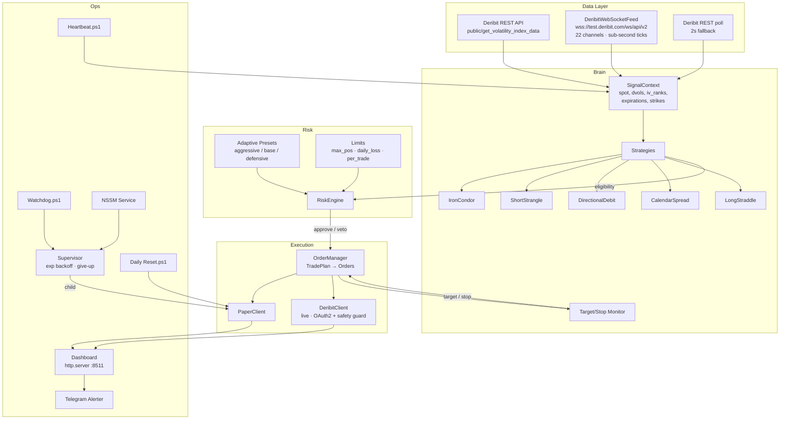
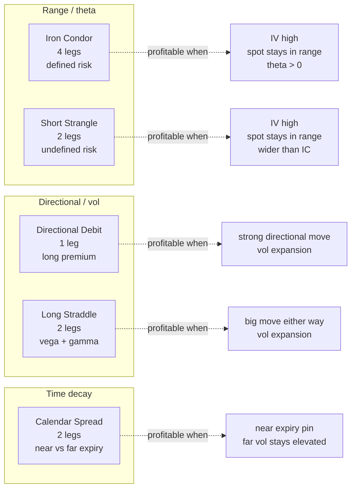

<div align="center">

# Deribit Paper Bot

### Real-time crypto options paper-trading on Deribit testnet

WebSocket market data · Black-Scholes Greeks · 5 multi-leg strategies · stdlib dashboard · NSSM-grade 6-layer production supervision

<br>

[](https://www.python.org/)
[](tests/)
[](LICENSE)
[](https://deribit.com)
[]()
[](crypto_options_bot/agent/)
[](https://agent.minimax.io)

<br>

[**Quick Start**](#-quick-start) · [**Architecture**](#-architecture) · [**Strategies**](#-strategies) · [**Production**](#-production-deployment) · [**Self-evolving]((#-6-agent-self-evolving-system)) · [**Docs**](#-documentation)

</div>

---

## 📌 What is this?

A **complete, production-grade crypto options paper-trading system** that:

- 🔌 Connects to **Deribit testnet** via real WebSocket feeds (sub-second ticks for BTC/ETH)
- 🧮 Computes **Black-Scholes Greeks** from scratch (no scipy) and uses real Deribit `mark_iv`
- 🎯 Runs **five multi-leg strategies** through a risk engine with adaptive presets
- 📊 Serves a **read-only stdlib HTTP dashboard** (no Flask/FastAPI dependency) on `:8511`
- 🛡️ Survives unattended 24/7 with a **7-layer supervision stack** (6 hard layers + 1 optional LLM layer; NSSM service + watchdog + heartbeat + scheduled tasks + supervisor with exponential backoff + the optional agent operator)
- 🤖 **Watches, heals, and evolves itself** with an optional **6-agent self-evolving / self-healing operator** driven by the local [MiniMax M3](https://agent.minimax.io) LLM (see [below](#-6-agent-self-evolving-system))
- 🚀 Flips to **live trading** with one CLI flag and three env vars — `DERIBIT_LIVE_CONFIRMED=YES`

> **Paper by default.** No real orders, no exchange auth, no real money. Public Deribit market-data endpoints need no credentials at all.
> The agent layer is **optional** — the bot runs and trades the same way with or without the operator. Without an LLM key, the agents fall back to rule-based decisions.

---

## ✨ Features

| Area | Highlights |
|------|------------|
| **Market data** | Real-time WS feed (sub-second) · REST polling fallback · DVOL index for IV rank · mark_iv (real Deribit) preferred over bisection |
| **Strategies** | Iron condor · short strangle · directional debit · calendar spread · long straddle |
| **Risk** | Max open positions · daily loss cap · per-trade stop · adaptive presets (aggressive / base / defensive) based on DVOL + recent P&L streak |
| **Trade mgmt** | Per-trade target/stop monitor · mark-to-market at bid/ask · persistent JSON state + CSV telemetry |
| **Ops** | stdlib dashboard (port 8511) · Telegram alerter · NSSM service installer · watchdog · 5-min heartbeat · daily housekeeping · supervisor with exponential backoff |
| **Self-evolving layer** *(optional)* | 6 LLM-driven agents — Sentinel (probe) · Healer (recover) · Trader (veto/dowsize) · Evolver (propose+deploy safe config changes) · Reflector (daily lessons) · Operator (orchestrator) |
| **Dependency footprint** | `loguru`, `pyyaml`, `python-dotenv`, `websocket-client`, `pytest`, `httpx` (LLM only) only. HTTP via `urllib`, dashboard via `http.server` — no `requests`, no `flask`, no `pandas`, no `numpy` |

---

## 📸 Screenshots

> Run `python -m crypto_options_bot paper --dashboard-port 8511` then open `http://127.0.0.1:8511/`.

| Dashboard (live) | `/api/status` JSON |
|---|---|
|  |  |
| `GET /` — live P&L, open trades, preset, strategy log | `GET /api/status` — machine-readable snapshot |

| `/api/ticks?currency=BTC` | Bot log (live) |
|---|---|
|  |  |
| Real-time chain ticks | Sub-second IV/mark refresh |

> Placeholder screenshots. Drop your own PNGs into `docs/screenshots/` and they'll render here.

---

## 🚀 Quick start

```powershell
# 1. (Optional) venv
python -m venv .venv
.\.venv\Scripts\pip install -r requirements.txt

# 2. (Optional) tweak config
copy .env.example .env

# 3. 30-second smoke test
python -m crypto_options_bot paper --max-runtime 30

# 4. State / dashboard
python -m crypto_options_bot status
python -m crypto_options_bot reset
```

Or use the batch wrapper:

```powershell
.\run_paper.bat --max-runtime 30
```

You should see within ~3 s:

```
SUCCESS | DeribitWebSocketFeed connected to wss://test.deribit.com/ws/api/v2
SUCCESS | first chain tick: ETH-25AUG26-2225-C ltp=0.1036 bid=0.103341 ask=0.103858 iv=1.5944
SUCCESS | [short_strangle] ETH PLAN: short strangle: range + high IV (iv_rank=50), credit=0.1038
SUCCESS | Executed plan T-5F236E2D9B: short_strangle ETH 2 legs
```

---

## 🏗 Architecture



**Key design choices**

- **Real Deribit data only** — public endpoints need no auth. We subscribe to the full BTC/ETH option chain (22 channels: spot index + per-instrument ticker).
- **Stdlib everywhere HTTP** — `urllib.request` for REST, `http.server.ThreadingHTTPServer` for the dashboard. Zero web framework.
- **`mark_price_proxy` fallback** — when testnet strikes have `bid=0/ask=0` (no resting orders), the bot transparently uses `mark_price` as both bid and ask. The leg still gets priced.
- **Real Greeks** — Black-Scholes (PDF/CDF) computed locally; positions marked to market at bid/ask on every cycle.

---

## 🎯 Strategies



| Strategy | Legs | Risk profile | IV view | Trigger |
|---|:-:|---|---|---|
| `iron_condor` | 4 | defined | high | range + high IV |
| `short_strangle` | 2 | undefined | high | range + high IV (wider) |
| `directional_debit` | 1 | defined (premium paid) | neutral | signal-driven long option |
| `calendar_spread` | 2 | defined | term structure | near-far IV differential |
| `long_straddle` | 2 | defined (premium paid) | expanding | large expected move |

Each strategy file in [`crypto_options_bot/strategy/`](crypto_options_bot/strategy/) implements `BaseStrategy.is_eligible(context) -> bool` and `BaseStrategy.build_plan(context) -> TradePlan | None`.

---

## ⚙️ Configuration

All knobs live in [`config/settings.yaml`](config/settings.yaml). Copy `.env.example` to `.env` for secrets. Key sections:

```yaml
data:
  feed_mode: ws              # ws | rest
  deribit_env: testnet       # testnet | production
  currencies: [BTC, ETH]
  poll_interval_sec: 2.0
  strike_window_pct: 8.0
  mark_price_proxy: true     # use mark_price when bid/ask=0 (testnet)

risk:
  max_open_positions: 4
  max_daily_loss_pct: 5.0
  max_trade_loss_pct: 30.0
  presets:
    aggressive: { max_pos: 5, daily_loss_pct: 7.0 }
    base:       { max_pos: 4, daily_loss_pct: 5.0 }
    defensive:  { max_pos: 2, daily_loss_pct: 3.0 }

broker:
  paper_capital: 100000.0
  slippage_bps: 5

strategy:
  iron_condor:    { enabled: true, wing_width: 200, profit_target_pct: 50 }
  short_strangle: { enabled: true, delta_threshold: 0.10, profit_target_pct: 50 }
  directional_debit: { enabled: true, ... }
  calendar_spread:   { enabled: true, ... }
  long_straddle:     { enabled: true, ... }
```

Env vars (`.env`):

```bash
# Live trading (paper mode is the default — none of these are required)
DERIBIT_CLIENT_ID=...
DERIBIT_CLIENT_SECRET=...
DERIBIT_LIVE_CONFIRMED=NO   # must be YES to go live

# Optional Telegram alerts
TELEGRAM_BOT_TOKEN=...
TELEGRAM_CHAT_ID=...
```

See the full reference in [Configuration reference](config/settings.yaml).

---

## 🛰 Production deployment (7-layer supervision with optional agent operator)

Crypto is 24/7, so the bot is designed to run unattended. The stack mirrors the mature kotak-neo-bot production setup, with an optional **7th layer** — the LLM-driven agent operator — on top:

| Layer | Mechanism | File | What it does |
|---:|---|---|---|
| 1 | Bot process | `python -m crypto_options_bot` | Self-restart logic in `supervisor.py` |
| 2 | Python supervisor | `crypto_options_bot.supervisor` | Re-spawns child with exponential backoff (5→10→20→40→60 s, cap 5 restarts / 10 min) |
| 3 | NSSM Windows service | `start_bot_service.ps1` | Auto-restarts the supervisor on crash; survives logon / reboot |
| 4 | Watchdog | `watchdog.ps1` | Polls bot + dashboard port; respawns via `start_bot_detached.ps1` if dead |
| 5 | Scheduled heartbeat | `heartbeat.ps1` | Every 5 min: health, log scan, decision log |
| 6 | Daily housekeeping | `daily_reset.ps1` | Archives CSVs to `logs/archive/`, rotates logs > 20 MB |
| 7 | **Operator** *(optional)* | `scripts/start_operator.ps1` + `start_bot_service.ps1 install-operator` | LLM-driven self-healing + self-evolving layer (see [below](#-6-agent-self-evolving-system)) |

### Quick recipes

```powershell
# Detached run (no admin)
.\start_bot_detached.ps1

# NSSM service (auto-start on boot, requires admin)
.\start_bot_service.ps1 install              # registers CryptoOptionsBot
.\start_bot_service.ps1 install-dashboard    # registers CryptoOptionsDashboard (:8511)
.\start_bot_service.ps1 install-operator     # registers CryptoOptionsOperator (6-agent layer)
.\start_bot_service.ps1 status
.\start_bot_service.ps1 remove

# Watchdog + heartbeat + daily reset under Task Scheduler
.\install_scheduled_tasks.ps1

# Manual probe
.\heartbeat.ps1
```

### Heartbeat sample

```
=== Heartbeat 2026-08-25 03:14:00 | crypto-options-bot ===
alive4=2 allBot=2
--- ERROR SCAN ---
  [logs\bot_stderr.log] no errors
  [logs\bot.log] size=283912 lastWrite=25-08-2026 03:13:59
--- DASHBOARD HEALTH ---
  /api/status HTTP 200 | 412 bytes
--- STATE FILES ---
  data_cache\paper_state.json size=2196 mtime=25-08-2026 03:13:50
  data_cache\trades_state.json size=2840 mtime=25-08-2026 03:13:50
  logs\trade_events.csv size=114 mtime=25-08-2026 03:13:50
  logs\pnl_history.csv size=523 mtime=25-08-2026 03:13:50
--- DECISION ---
  bot alive (alive4=2 allBot=2) -> no restart
=== END HEARTBEAT ===
```

---

## 🤖 6-agent self-evolving system

The bot is wrapped by an **optional** second loop — the *Operator* — that watches, heals, and quietly evolves the system. It runs as its own long-lived process (`python -m crypto_options_bot operator`) driven by an LLM (default: MiniMax M3). **The bot does not depend on it** — if the Operator is down, the bot keeps trading and the dashboards stay up.

```mermaid
graph TB
    subgraph "Operator (LLM-driven, optional)"
        OP[Operator<br/>scheduler · status · budget]

        subgraph "Loop @60s"
            SE[Sentinel<br/>probe bot · heartbeat · WS · disk]
            HE[Healer<br/>playbooks: bot_dead · ws_no_channels ·<br/>heartbeat_warn · orphans · disk_low]
        end

        subgraph "Loop @6h"
            EV[Evolver<br/>reads journal · proposes JSON diffs ·<br/>auto-deploys low-risk (±20% rel, ±5% abs)]
        end

        subgraph "Loop @daily 00:05 UTC"
            RF[Reflector<br/>writes memory/lessons/YYYY-MM-DD-<slug>.md]
        end

        TR[Trader<br/>wraps the 5 strategies;<br/>LLM returns APPROVE / VETO /<br/>DOWNSIZE / HOLD with target_qty]

        TO[ToolRegistry<br/>read_paper_state · read_settings ·<br/>list_lessons · list_proposals ·<br/>approve_proposal · reject_proposal · write_journal]

        ME[Memory<br/>state/ · history/ · lessons/ ·<br/>proposals/ · health/ · journal/]

        LL[LLMClient<br/>MiniMax · Anthropic-compatible<br/>budget · retry · mockable]
    end

    subgraph "Bot (always runs)"
        BOT[Paper / Live runner]
        OM[OrderManager]
        RE[RiskEngine]
    end

    SE -->|health report| HE
    HE -->|restart bot, free port, etc.| BOT
    TR -->|veto / downsize| BOT
    TR -->|advisory only| OM
    BOT -.->|paper_state.json| SE
    BOT -.->|paper_state.json| TR
    BOT -.->|trade_events.csv| EV

    SE --> ME
    HE --> ME
    TR --> ME
    EV --> ME
    RF --> ME

    TR --> LL
    EV --> LL
    RF --> LL

    EV --> TO
    TR --> TO
    TO --> ME
```

### Agent catalog

| # | Agent | File | Cadence | Job |
|---|---|---|---|---|
| 1 | **Sentinel** | `crypto_options_bot/agent/sentinel.py` | 60 s | Probe bot PID, dashboard port, log freshness, WS subscriptions, open positions, disk space |
| 2 | **Healer** | `crypto_options_bot/agent/healer.py` | 60 s (right after Sentinel) | Match a HealthReport against playbooks (`bot_dead`, `heartbeat_warn`, `ws_no_channels`, `orphans`, `disk_low`) and run the cheapest recovery |
| 3 | **Trader** | `crypto_options_bot/agent/trader.py` | every cycle (advisory) | Read the bot's next TradePlan, ask the LLM for APPROVE / VETO / DOWNSIZE / HOLD with a `target_qty`. Hard rails = `RiskEngine` (LLM can never widen caps) |
| 4 | **Evolver** | `crypto_options_bot/agent/evolver.py` | 6 h | Read trade journal + paper state + last lesson, ask the LLM for a JSON config diff, classify risk, auto-deploy if within rails, else escalate to a human-approval proposal |
| 5 | **Reflector** | `crypto_options_bot/agent/reflector.py` | daily @ 00:05 UTC | Read the day's trades + yesterday's lesson, write a Markdown lesson to `memory/lessons/` |
| 6 | **Operator** | `crypto_options_bot/agent/operator.py` | always | Wires the above via a cron-like scheduler, owns shared `Memory` and `LLMClient`, writes its own heartbeat to `data_cache/operator.heartbeat` |

### Autonomy tiers (per-agent)

The blast radius matches the responsibility. **Trader and Healer can never modify code or strategy logic** — they only nudge the existing risk-aware execution path.

| Agent | Can touch | Hard rails (cannot cross) |
|---|---|---|
| Healer | restart bot, free dashboard port, rotate logs | never edits strategy or risk code, never opens/closes positions |
| Trader | `target_qty` (downward only), veto, hold | never widens `RiskEngine` caps, never changes strategy eligibility, never places orders directly |
| Evolver | mutates `config/settings.yaml` | max ±20 % relative / ±5 percentage-point absolute per call; only known scalar keys; ≥3 keys always escalates; `max_open_positions` always escalates |
| Reflector | writes to `memory/lessons/` only | read-only everywhere else |
| Sentinel | none | reads only |
| Operator | none directly; orchestrates the others | read-only on bot state, owns `Memory` and budget |

Proposals that exceed rails land in `memory/proposals/*.json` with `status: pending` and are surfaced by `python scripts/operator_status.py`. The `approve_proposal` / `reject_proposal` tools are the human escape hatch.

### LLM cost controls

`agent:` block in `config/settings.yaml`:

| Knob | Default | What it does |
|---|---:|---|
| `llm_model` | `minimax/MiniMax-M3` | Swap for a cheaper model when cost matters |
| `daily_token_limit` | 500 000 | Hard cap; Operator skips discretionary calls once hit |
| `daily_call_limit` | 5 000 | Hard cap on calls per UTC day |
| `fallback_enabled` | `true` | When the LLM is unreachable or budget exhausted, agents fall back to rules (`APPROVE` for Trader, `no-op` for Evolver/Reflector) |
| `autonomy` | `moderate` | Sets how aggressive Evolver is. `conservative` = always human-approve; `moderate` = auto-deploy low-risk only; `aggressive` = also deploy 3-key changes that stay within rails |

### Prompt strategy

Prompts live in `crypto_options_bot/agent/prompts/`:

- `trader_system.md` — fixed system prompt: role, hard rails, JSON schema, examples
- `trader_decision.md` — per-cycle template: spot, IV, strategy, plan, open trades
- `evolver_review.md` — weekly-style review prompt with the full journal slice
- `reflector_daily.md` — daily review prompt with P&L, win/loss, regime notes

All prompts demand **strict JSON** output. The agents re-parse the LLM's reply with a permissive wrapper and degrade gracefully on parse errors (never crash the operator).

### Memory layout (gitignored)

```
memory/
  state/      sentinel_latest.json, healer_latest.json         # atomic JSON
  history/    trader_decisions_YYYY-MM-DD.jsonl                 # append-only
  lessons/    YYYY-MM-DD-<slug>.md                              # Reflector output
  proposals/  <proposal_id>.json    status: pending|approved|deployed|rejected
  health/     YYYY-MM-DD.jsonl                                 # Healer reports
  journal/    YYYY-MM-DD.md                                    # every agent's notable decisions
```

The `memory/` folder is `.gitignore`d — every operator restart rebuilds state from the live bot + the existing JSONL history.

### Running the operator

```powershell
# 1. Mint an LLM key and add to .env
#    MINIMAX_API_KEY=sk-your-key-here

# 2. 30-second smoke test
python -m crypto_options_bot operator --max-runtime 30

# 3. Detached 24/7 run
.\scripts\start_operator.ps1

# 4. Stop
.\scripts\stop_operator.ps1

# 5. Pretty-print status
python scripts\operator_status.py

# 6. Health probe (exit 0 = alive and fresh)
powershell -File scripts\operator_health.ps1

# 7. Register under Task Scheduler (probe every 5 min, restart on failure)
powershell -File scripts\start_operator.ps1   # start once
# then point Task Scheduler at scripts\operator_health.ps1 with an AtStartup trigger
```

### Operator status sample

```
============================================================
  Crypto Options Bot — Operator Status
============================================================
  Cycles:          1742
  Heartbeat age:    12.4s  (PID=13084)

  Scheduled jobs:
              sentinel   runs=1742  errors=0   next=48s
              healer     runs=1742  errors=0   next=48s
              evolver    runs=3     errors=0   next=21475s
              reflector  runs=0     errors=0   next=14523s
              heartbeat  runs=1742  errors=0   next=18s

  Latest Sentinel probe:
    BOT-DEAD, ws-no-channels pos=0 trades=0 ws=0

  Latest Healer run:
    ✓ bot_dead           sev=high   sentinel reports BOT-DEAD, no heartbeat < 300s
    · ws_no_channels     sev=warn   WS not subscribed (will retry on next probe)

  Recent Reflector lessons:
    - 2026-09-17-iron-condor-tight-testnet.md
============================================================
```

### Tests

119 unit tests cover every agent (LLM calls mocked via `LLMClient(api_key="sk-test", mock=fn)` — zero network in CI). See:

- `tests/test_agent_llm.py` — MiniMax API wrapper, budget, retry, mock
- `tests/test_agent_memory.py` — atomic JSON writes, JSONL append, proposal state machine
- `tests/test_agent_scheduler.py` — every_sec / at_hhmm, pause/resume, error caps
- `tests/test_agent_tools.py` — read-only vs. write-state journal, args schema
- `tests/test_agent_sentinel_healer.py` — every probe + playbook
- `tests/test_agent_trader.py` — APPROVE / VETO / DOWNSIZE / HOLD + fallback path
- `tests/test_agent_evolver.py` — diff validation, risk classification, auto-deploy rails
- `tests/test_agent_reflector.py` — lesson filename + Markdown body shape
- `tests/test_agent_operator.py` — wiring, status, heartbeat fsync

---

## 🌐 Dashboard tour

```powershell
python -m crypto_options_bot paper --dashboard-port 8511
```

Then open `http://127.0.0.1:8511/`.

| Route | What it returns |
|---|---|
| `GET /` | HTML page: live account summary, open trades, target/stop progress, strategy log, recent ticks |
| `GET /api/status` | JSON: `mode`, `feed`, `account` (cash / total / realized / unrealized), `risk` (paused / daily P&L / open positions) |
| `GET /api/ticks?currency=BTC\|ETH` | JSON: latest ticks for the requested underlying (price, bid, ask, IV) |

The page auto-refreshes every 5 s. The dashboard is read-only — all actions go through the CLI.

---

## 💬 Telegram alerts setup

```bash
# 1. Create a bot via @BotFather → TELEGRAM_BOT_TOKEN
# 2. Get your chat id via @userinfobot → TELEGRAM_CHAT_ID
# 3. Add to .env
TELEGRAM_BOT_TOKEN=123456:ABC-DEF...
TELEGRAM_CHAT_ID=987654321
```

The alerter fires on: open trade, target hit, stop hit, daily loss cap, fatal error.

---

## 📚 Documentation

- [**Live trading setup**](config/settings.yaml) — flip from paper to live with three env vars
- [**Configuration reference**](config/settings.yaml) — every YAML key documented inline
- [**File layout**](#-file-layout) — module map
- [**Operations runbook**](#-operations-runbook) — common errors and how to add a new strategy

---

## 🛠 Operations runbook

### Adding a new strategy

1. Create `crypto_options_bot/strategy/my_strategy.py`, subclass `BaseStrategy`, implement `is_eligible` + `build_plan`.
2. Add a `StrategyName.MY_STRATEGY = "my_strategy"` value to `crypto_options_bot/strategy/base.py`.
3. Add a config block under `strategy:` in `config/settings.yaml`.
4. Register the strategy in `__main__.PaperRunner._build_strategies`.
5. Add unit tests in `tests/test_strategies.py`.

### Common errors

| Symptom | Cause | Fix |
|---|---|---|
| `Refusing to start live DeribitClient without DERIBIT_LIVE_CONFIRMED=YES` | Safety guard | Set the env var to `YES` |
| `WS feed failed to connect within 3s, falling back to REST` | Network blip | Bot auto-falls-back, no action needed |
| `daily loss cap hit` | Drawdown breach | Wait, or `python -m crypto_options_bot reset` (paper) |
| `iron_condor: missing option LTP` | Testnet strike has no data | Skipped for that cycle, no crash |
| `PermissionError` on log open | NSSM / service context log ACL | Run as a user with write access to `logs/`, or change `log_file` path |

### Useful commands

```bash
python -m crypto_options_bot paper --max-runtime 30      # 30 s smoke
python -m crypto_options_bot paper --max-runtime 30 --verbose
python -m crypto_options_bot paper --feed rest --max-runtime 30
python -m crypto_options_bot paper --dashboard-port 8511
python -m crypto_options_bot supervisor paper             # auto-restart loop
python -m crypto_options_bot operator --max-runtime 30   # operator 30 s smoke
python -m pytest tests/ -v
```

```powershell
.\scripts\start_operator.ps1                            # detached operator
.\scripts\stop_operator.ps1                             # graceful stop
python scripts\operator_status.py                        # human-readable status
powershell -File scripts\operator_health.ps1             # exit-0 probe for monitors
```

---

## 🗂 File layout

```
crypto-options-bot/
├── crypto_options_bot/
│   ├── __main__.py              # CLI: paper / live / status / reset / operator
│   ├── supervisor.py            # Auto-restart on crash with exp backoff
│   ├── data/
│   │   ├── deribit_feed.py      # REST polling feed (2 s)
│   │   └── deribit_ws.py        # WebSocket feed (sub-second, default)
│   ├── broker/
│   │   ├── base.py              # BrokerClient ABC + Order/Position/Trade
│   │   ├── paper_client.py      # In-memory + JSON persistence
│   │   └── deribit_client.py    # Live REST client (OAuth2 + safety guard)
│   ├── risk/
│   │   ├── greeks.py            # Black-Scholes (no scipy)
│   │   └── engine.py            # Position cap, daily loss, adaptive presets
│   ├── strategy/
│   │   ├── base.py              # SignalContext, TradePlan, StrategyName
│   │   ├── _helpers.py          # Shared strike/expiry snapping
│   │   ├── iron_condor.py       # 4-leg range-bound
│   │   ├── short_strangle.py    # 2-leg undefined-risk
│   │   ├── directional_debit.py # 1-leg long option
│   │   ├── calendar_spread.py   # 2-leg time decay
│   │   └── long_straddle.py     # 2-leg vol expansion
│   ├── execution/
│   │   └── order_manager.py     # TradePlan → broker orders, JSON state
│   ├── alerts/
│   │   └── telegram.py          # Optional TelegramAlerter
│   ├── dashboard/
│   │   └── server.py            # stdlib http.server + read-only HTML
│   ├── agent/                   # 6-agent self-evolving system (optional)
│   │   ├── __init__.py          # re-exports LLMClient, Memory, Scheduler
│   │   ├── llm.py               # MiniMax API wrapper · budget · retry · mockable
│   │   ├── memory.py            # atomic JSON · JSONL history · lessons · proposals
│   │   ├── scheduler.py         # cron-like · every_sec | at_hhmm · pause/resume
│   │   ├── tools.py             # LLM-callable functions (READ / WRITE_STATE)
│   │   ├── sentinel.py          # process · heartbeat · WS · positions
│   │   ├── healer.py            # bot_dead · heartbeat_warn · ws_no_channels · …
│   │   ├── trader.py            # APPROVE / VETO / DOWNSIZE / HOLD wrapper
│   │   ├── evolver.py           # journal-driven config diffs + auto-deploy rails
│   │   ├── reflector.py         # daily lesson writer
│   │   ├── operator.py          # top-level orchestrator
│   │   └── prompts/             # LLM prompts (Markdown, versioned)
│   └── utils/
│       └── logger.py            # loguru sink config
├── scripts/                     # operator lifecycle + status
│   ├── start_operator.ps1       # detached launcher with PID file
│   ├── stop_operator.ps1        # graceful kill
│   ├── operator_health.ps1      # exit-0 probe for Task Scheduler
│   └── operator_status.py       # pretty-print status snapshot
├── tests/                       # 119 unit tests (1 skipped)
│   ├── test_greeks.py
│   ├── test_paper_broker.py
│   ├── test_order_manager.py
│   ├── test_risk_engine.py
│   ├── test_strategies.py
│   ├── test_target_stop_monitor.py
│   └── test_agent_*.py          # 9 files covering the 6-agent layer
├── docs/screenshots/            # place README screenshots here
├── config/settings.yaml         # all knobs (incl. agent: block)
├── start_bot_service.ps1        # NSSM installer (+ install-operator)
├── start_bot_detached.ps1       # plain detached launcher
├── stop_bot_service.ps1
├── watchdog.ps1
├── heartbeat.ps1
├── daily_reset.ps1
├── supervisor_loop.ps1
├── install_scheduled_tasks.ps1
├── run_paper.bat
├── .env.example
├── requirements.txt
├── LICENSE
└── README.md
```

---

## 🧪 Testing

```bash
python -m pytest tests/ -v
```

43 unit tests cover: Black-Scholes Greeks against known values, paper-broker fills + average price + realized P&L, order-manager plan execution + state persistence, risk engine caps + adaptive presets, all five strategies (eligibility + leg-picking), target/stop monitor. The agent layer adds **76 more tests** (LLM mocked, never makes a real network call): every agent's probe + playbook + decision path, the scheduler's `every_sec` / `at_hhmm` semantics, the LLM client's retry + budget, the memory layer's atomic writes, the operator's end-to-end wiring.

---

## ⚖️ Risk

- **Paper by default.** No exchange auth, no real orders. `PaperClient` is purely in-memory + JSON.
- **Risk engine** caps max open positions, daily loss, per-trade loss, and halves qty when DVOL/IV rank are extreme. Adaptive presets lift or lower caps based on DVOL + recent P&L.
- **Mark-to-market** is conservative: long positions at BID, short at ASK.
- **Crash recovery**: state saved to `data_cache/paper_state.json` on every change; trades persisted to `data_cache/trades_state.json`.
- **Live mode safety guard**: `DeribitClient` refuses to start unless `DERIBIT_LIVE_CONFIRMED=YES` is in the environment.

---

## 🗺 Roadmap

Delivered in this build:
- ✅ 6-agent self-evolving / self-healing operator (LLM-driven, optional)
- ✅ Strict JSON prompt contracts + LLM budget / fallback
- ✅ Atomic JSON state + append-only JSONL history under `memory/`
- ✅ Auto-deploy low-risk config changes; ≥3-key changes escalate to human-approval
- ✅ Daily Markdown lessons written to `memory/lessons/`

Coming next:
- Backtesting harness (historical Deribit data)
- More venues (Bybit options, OKX options)
- ML-based regime / signal classifier
- Greeks-based risk dashboard (heatmaps, scenario analysis)
- Dashboard v2: close-all kill-switch + strategy toggle

---

## 📄 License

[MIT](LICENSE) — see LICENSE for the full text.
